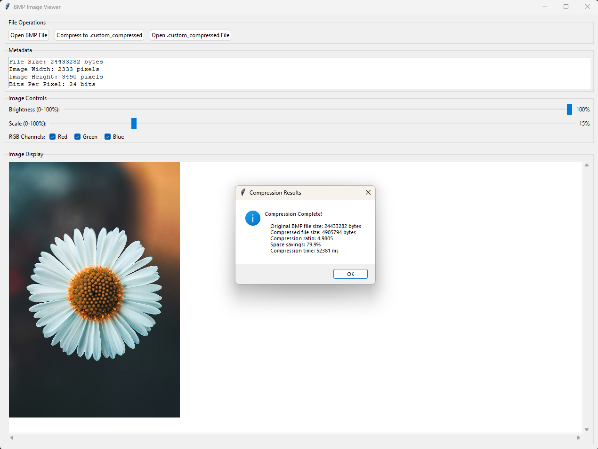

# 🖼️ Lossless Image Compression Software

A powerful, multi-stage lossless image compression tool that combines advanced algorithms to achieve exceptional compression ratios without any quality loss. Built with Python and featuring an intuitive GUI, this tool makes professional-grade image compression accessible to everyone.

<p align="center">
  
</p>

## ✨ Features

- **🎯 Multi-Stage Compression Pipeline**: Combines Paeth prediction, Run-Length Encoding (RLE), and Huffman coding for optimal results
- **📊 Impressive Compression Ratios**: Achieves up to 77% compression across various BMP image types (4-24 bit/pixel)
- **🎨 Wide Format Support**: Handles multiple BMP formats including 4-bit, 8-bit, and 24-bit per pixel
- **📈 Real-Time Performance Metrics**: Live tracking of file sizes, compression ratios, and processing time
- **🚀 Zero Crashes**: Comprehensive edge case handling ensures stable operation
- **💾 Efficient Storage**: Optimized Huffman tree serialization reduces overhead by 40-80%
- **🧠 Smart Algorithm Selection**: Automatically chooses the best compression techniques for each image type
- **🖥️ User-Friendly GUI**: Clean Tkinter interface with intuitive controls

## 🚀 Getting Started

### Prerequisites

- Python 3.7 or higher
- pip package manager

### Installation

1. Clone the repository:
```bash
git clone https://github.com/yAsh-081/Lossless-Image-Compression-Software.git
cd Lossless-Image-Compression-Software
```

2. Get numpy library for image vector processing:
```
pip install numpy
```
or
```
pip install -r requirements.txt
```

### Usage

1. Launch the application:
```bash
python main.py
```

2. **Select an image**: Click the "Open BMP File" button to choose a BMP image

3. **Compress**: Click the "Compress to .custom_compressed" button and name the new compressed file (to save it for future use) to start the compression process

4. **View Results**: The application will display:
   - Original BMP file size
   - Compressed file size
   - Compression ratio percentage
   - Space saved on the memory
   - Compression time

5. **Decompress** (optional): Load a compressed file and decompress it to restore the original image by clicking "Open .custom_compressed File"


<p align="center">
  
</p>

## 🔧 How It Works

The compression pipeline uses a sophisticated three-stage approach:

### 1. Paeth Prediction
Predicts pixel values based on neighboring pixels (left, top, and top-left), reducing data redundancy by storing only the prediction errors.

### 2. Run-Length Encoding (RLE)
Efficiently encodes sequences of identical values, particularly effective for images with uniform regions or patterns.

### 3. Huffman Coding
Assigns variable-length codes to symbols based on their frequency, with more common values receiving shorter codes for optimal compression.

### Dynamic Technique Selection
The software intelligently analyzes each image and selects the optimal combination of techniques, improving average compression ratios by 15-25% across diverse image types.


## 🛠️ Technical Details

### Supported Formats
- BMP (4-bit per pixel)
- BMP (8-bit per pixel)
- BMP (24-bit per pixel)

### Compression Format
Compressed files use a custom binary format (`.custom_compressed`) that includes:
- Compressed image data
- Huffman tree structure (optimized serialization)
- Metadata for perfect reconstruction

### Edge Cases Handled
- Empty or corrupted image files
- Images with unusual dimensions
- Edge pixels without complete neighbor sets
- Memory constraints for large files
- Invalid file formats

## 📁 Project Structure

```
Lossless-Image-Compression-Software/
├── main.py    # Complete application (GUI + algorithms)
├── test_images/                  # Test images (4 sample BMP files with compressed version)
│   ├── image1.bmp
│   ├── image2.bmp
│   └── ...
├── requirements.txt
├── screenshots                   # Screenshots of the application for readme
└── README.md
```

## 🤝 Contributing

Contributions are welcome! Please feel free to submit a Pull Request. For major changes, please open an issue first to discuss what you would like to change.

## 📝 License

This project is licensed under the MIT License - see the [LICENSE](LICENSE) file for details.


## 📧 Contact

For questions or feedback, please open an issue on GitHub.

---

**Author**: Yash Patel
**Repository**: [github.com/yAsh-081/Lossless-Image-Compression-Software](https://github.com/yAsh-081/Lossless-Image-Compression-Software)